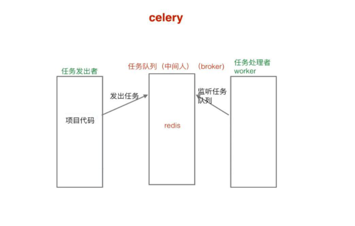

# Djangoz项目-天天生鲜


### 分析表模型

#### 远程连接mysql
1. settings配置
2. mysql的配置文件 etc/mysql/mysql.conf.d/mysqld.conf 
3. bind address
4. sudo service mysql restart

`4.18`
### 注册激活
#### 原理
1. 给用户发送一个链接,链接中要包含该用户的信息
2. 当用户点击这个链接后,网站后台接受请求,解析出url中的用户信息,根据这个信息来进行激活
3. 链接中的信息,需要**加密**.如果可以轻易破解更改,就会有恶意人士,通过更改url中的信息,来改变网站后台数据库的信息 

#### 激活信息的加密
- 导入`itsdangerous`包
  - `pip install itsdangerous`
- 在视图函数中导包
  - `from itsdangerous import TimedJSONWebSignatureSerializer as Serializer`
- 创建一个Serializer对象,用来给信息加密解密
  - 参数一:密钥;参数二:过期时间/s
  - `serializer = Serializer('secretkey', 3600)`
- 准备要发送的信息
- 使用`serializer`进行加密,揭秘
  - 加密 `serializer.dumps(info)`
  - 解密 `serializer.loads(info)`

#### 流程
1. 在注册视图中生成token
2. celery异步任务发送激活邮件
3. 激活视图中处理请求
   - 1.还原token
   - 2.获取用户信息
     - 获取成功:在数据库中激活用户,返回登陆页
     - 获取失败(token过期):捕获错误,返回处理页面

### 发送验证邮件
- 异步处理
  - 发送邮件费时,为了用户体验,使用异步处理



#### 发送邮件
1. 邮件方发送邮箱的设置--SMAP
2. 在settings中设置
   - 邮箱配置
3. 在view函数中`send_mail(-,-,-,handle_message)`
   
- celery
  - 安装 celery
  - redis
  - 任务队列 中间人
- 使用步骤
  2. 初始化  
  1. 创建  Celery对象

  2. 定义任务函数
 

`4.19`
### 登陆

- 登陆与登陆校验在同一url
- login类视图
   - `get`登陆
   - `post`登陆校验
  
#### `post`登陆校验

- 接收数据
- 初步校验数据
- 业务处理:登陆校验
  - django内置用户认证系统
  - authenticate(**credentials)[source]¶
请使用authenticate()，认证一组给定的用户名和密码。它接收关键字参数形式的凭证，使用默认配置时参数是username和password，如果密码能够匹配给定的用户名，它将返回一个User对象。如果密码无效，authenticate()返回None。例子：
 
  ```
  from django.contrib.auth import authenticate
user = authenticate(username='john', password='secret')
if user is not None:
    # the password verified for the user
    if user.is_active:
        print("User is valid, active and authenticated")
    else:
        print("The password is valid, but the account has been disabled!")
else:
    # the authentication system was unable to verify the username and password
    print("The username and password were incorrect.")
  ```
  - 如果已激活使用django内置的login()
  - `login(rediret_url,)`
  - 记住用户名 `set_cookie()`
     - 不记住 删除cookie `delete_cookie("key")`
     
### 父模版

- 抽取父模板
- 所有内容都一样
  - 父模版
- 有的地方不一样
  - 预留块
    
    
### 登陆装饰器

- django内置的`login_required()`
- 使用类视图函数,不能在views函数中增加装饰器,而是在url配置中


使用方法
1. URL配置中,添加装饰器
2. settings中设置`LOGIN_URL`,设置为未登录状态跳转的页面


### 用户中心-地址页

### 历史浏览记录

- 访问商品详情页面时,需要添加历史浏览记录
- 访问用户个人信息页的时候,要获取历史浏览记录
- 存储方式
  - redis -- 内存型数据库
  - 历史浏览记录经常要读写,mysql速度不够

- redis中存储历史浏览记录的格式
   - 每个用户的记录,用一条数据保存
   - 数据格式:list
   - 添加历史浏览记录时,从list左侧插入,每次读取最新浏览的商品id
  


`4.21`
### fastDFS简介
- 海量存储
- 存储容量扩展方便
- 解决文件内容重复问题--文件指纹

#### 通过fastDFS上传存储文件
- Django有自带的文件存储类
- 自定义文件存储类,继承Django的类 `from django.core.files.storage import Storage`
  - `class FDFSStorage(Storage)`
- `Storage`中的方法
   1. _open()
   2. _save()
   3. exists()
- 设置Django默认文件存储 settings
  - `DEFAULT_FILE_STORAGE`

- 优化,解藕
  - `class FDFSSTORage(Storage)`初始化

### nginx
- 图片上传是由fdfs-tracker生成文件指纹,存储在fdfs-storage中
- 图片的下载使用fdfs效率不高,需要用到ngnix服务器
- 图片下载时,由django服务器渲染请求地址,浏览器请求时,发送到ngnix服务器,ngnix查找到对应的文件,再发送回去
 

### 首页

#### 首页表单模型分析

#### 首页
- 视图函数中
	1. 获取商品种类信息
	2. 获取首页轮播图
	3. 首页促销内容
	4. **首页分类商品展示信息**
	   - 不能直接获取全部,而是要遍历之前得到的
	   - 获取相应的图片信息和文字信息 
	   - 动态给type增加属性
	     
	5. 购物车商品数量
	6. 组织模版上下文
	7. 传递参数
- 主页模板中
  - 接收参数
  - 遍历显示

- 购物车记录
  - 点击加入购物车时,需要添加购物车记录
    - list页面   

`4.22`

### 首页页面静态化

- 使用celery定义任务函数,生成静态页面
- 通过nginx提供静态页面

### 页面数据缓存


### 页面静态化和数据缓存
- 网站本身性能的优化,减少数据库查询
- 防止DDOS攻击


`4.24`
### 搜索引擎

1. 全文导入搜索框架 	`haystack`
2. 使用搜索引擎`whoosh`
3. `whoosh`自带的中文分词不好用,使用中文分词包`jieba`

### 购物车js代码
实现增加、减少商品数量,总价变化

### 右上角购物车增加视图函数
由于增加商品数量时,网址没有变化,因此要使用ajax实现局部刷新,更改购物车的条目数

- 购物车的信息经常会变更,因此存储在redis,而不是mysql中
- 业务处理--redis

### 购物车详情页面


`4.25`
### 购物车详情页面

- 购买物品件数不通过前端传回去


`4.27`
### 订单相关
 - 提交订单需要使用事务,保证命令的完整性


#### 事务
- 特点
  1. 原子性  保证一组事务,要么成功,要么撤回
  2. 稳定性
  3. 隔离性
  4. 可靠性

- 在mysql中
  - 事务控制 
	  1. 启动事务 	`begin`
	  2. 命令语句输入
	  3. 提交 `commit`
	  4. 回滚 `rollback`
  - 保存点
     1. 创建保存点
     2. 删除保存点
     3. 回滚到保存点
 
 
 - 在python中
   
   1. 导入`from django.db import transaction` 
   2. 在事务函数前使用事务的装饰器
   3. 创建保存点
   4. 使用try except语句,捕获错误
   5. 不成功rollback
   6. 成功的话commit


#### 订单并发

- 应用场景:秒杀、同时下单等

- 解决办法
  1. 悲观锁
     - 原理
        - 一个进程进行查询库存下单时,认为**存在别的进程也要查询相同的信息**(悲观),因此在查询数据库前提前上锁,只有本进程的事务结束后,才释放锁,允许别的进程查询
     - 使用
        - `Model.objects.select_for_update_.get()`
        
   
  2. 乐观锁
     - **原理**:假设没有别的进程查询更改相同的信息,查询时不上锁,提交更改时进行判断
     - 两种思路
       1. 循环
       2. F对象
- 访问较少时使用乐观锁,访问多时使用悲观锁
 
 
 
#### 订单生成

- 订单支付完成后,需要由用户再次访问网站,获取订单完成的信息


### 网站部署

- 不由django启动,而是uwsgi
- 浏览器访问nginx,nginx访问uwsgi,uwsgi访问Django

 
    


